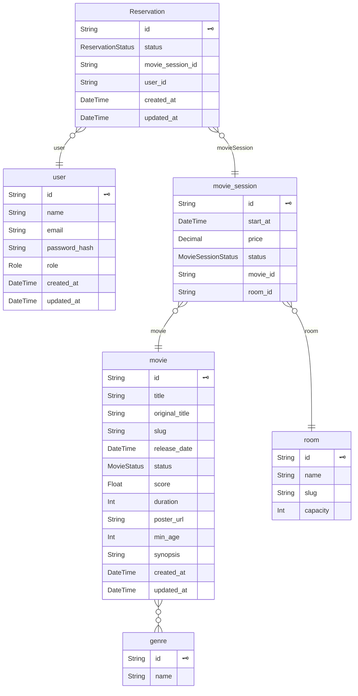

```mermaid
erDiagram

  "user" {
    String id "🗝️"
    String name
    String email
    String password_hash
    Role role
    DateTime created_at
    DateTime updated_at
    }


  "movie" {
    String id "🗝️"
    String title
    String original_title
    String slug
    DateTime release_date
    MovieStatus status
    Float score
    Int duration
    String poster_url
    Int min_age
    String synopsis
    DateTime created_at
    DateTime updated_at
    }


  "genre" {
    String id "🗝️"
    String name
    }


  "room" {
    String id "🗝️"
    String name
    String slug
    Int capacity
    }


  "movie_session" {
    String id "🗝️"
    DateTime start_at
    Decimal price
    MovieSessionStatus status
    String movie_id
    String room_id
    }


  "Reservation" {
    String id "🗝️"
    ReservationStatus status
    String movie_session_id
    String user_id
    DateTime created_at
    DateTime updated_at
    }

    "movie" o{--}o "genre" : ""
    "movie_session" }o--|| movie : "movie"
    "movie_session" }o--|| room : "room"
    "Reservation" }o--|| movie_session : "movieSession"
    "Reservation" }o--|| user : "user"
```
