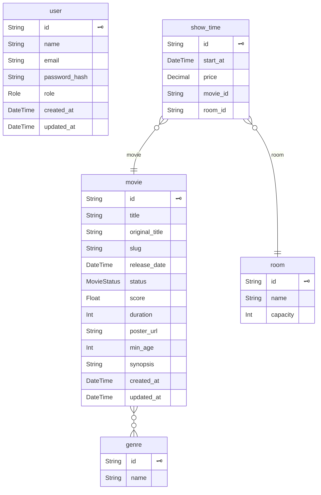

```mermaid
erDiagram

  "user" {
    String id "🗝️"
    String name 
    String email 
    String password_hash 
    Role role 
    DateTime created_at 
    DateTime updated_at 
    }
  

  "movie" {
    String id "🗝️"
    String title 
    String original_title 
    String slug 
    DateTime release_date 
    MovieStatus status 
    Float score 
    Int duration 
    String poster_url 
    Int min_age 
    String synopsis 
    DateTime created_at 
    DateTime updated_at 
    }
  

  "genre" {
    String id "🗝️"
    String name 
    }
  

  "room" {
    String id "🗝️"
    String name 
    Int capacity 
    }
  

  "show_time" {
    String id "🗝️"
    DateTime start_at 
    Decimal price 
    String movie_id 
    String room_id 
    }
  
    "movie" o{--}o "genre" : ""
    "show_time" }o--|| movie : "movie"
    "show_time" }o--|| room : "room"
```
